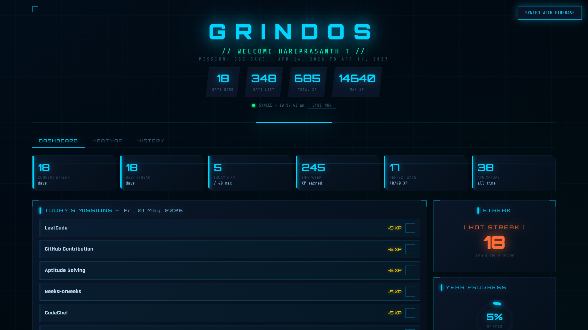
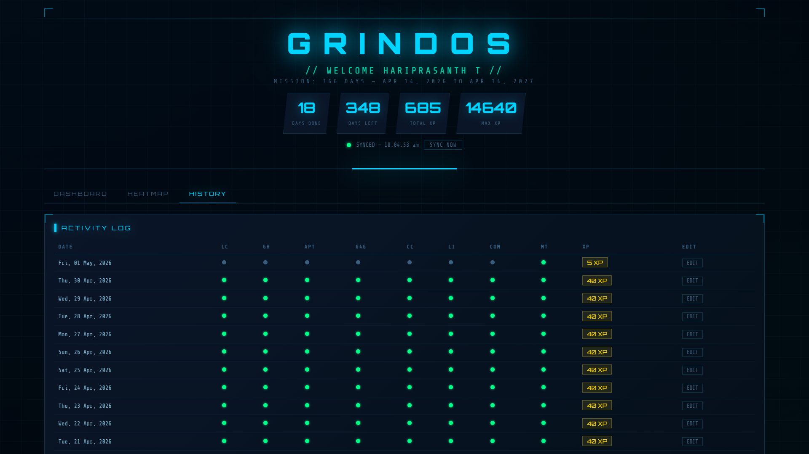
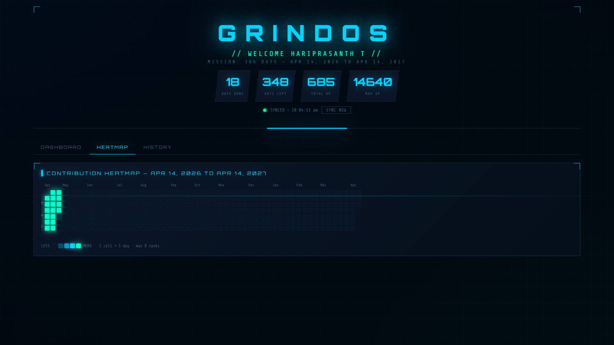
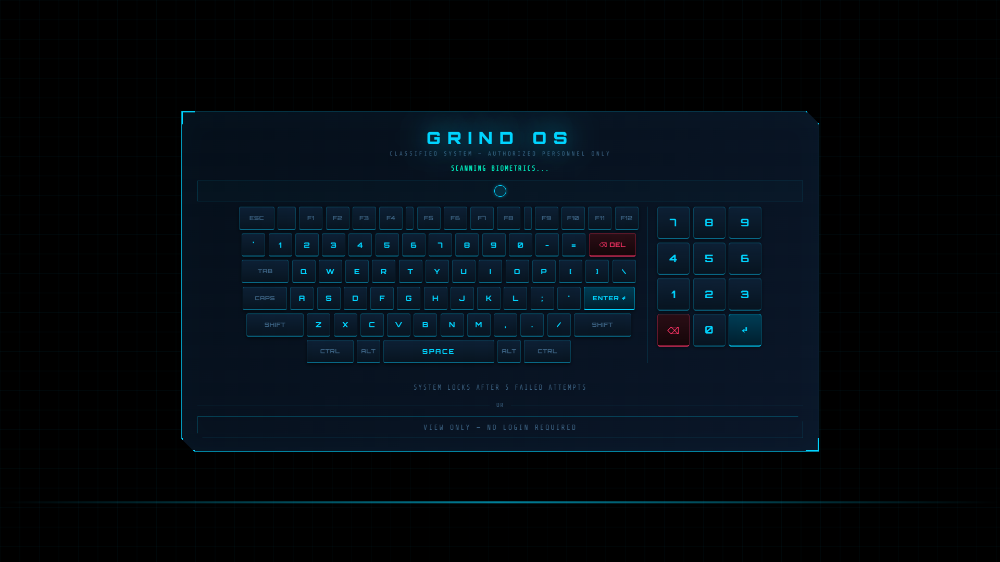

# GRIND OS

Grind OS is a productivity-focused web application designed to track daily consistency, progress, and discipline through a structured system of tasks, streaks, and performance metrics.

---

## Overview

Grind OS enables users to:

- Track daily missions such as coding practice and learning activities  
- Maintain consistency through streak tracking  
- Monitor progress using an XP-based system  
- Visualize activity through logs and heatmaps  
- Stay accountable with a structured daily workflow  

---

## Screenshots

### Dashboard

### Activity History

### Heatmap

### Login Interface

---

## Features

- Daily task tracking  
- Streak monitoring  
- XP-based progress system  
- Activity history log  
- Contribution heatmap  
- Firebase synchronization  

---

## Tech Stack

- HTML (with embedded CSS and JavaScript)  
- Firebase Hosting  
- GitHub Actions (CI/CD)

---

## Deployment

The application is deployed using Firebase Hosting with automated deployment via GitHub Actions.

Any changes pushed to the main branch are automatically deployed to the live site.

---

## Author

Hariprasanth

---

## Future Improvements

- Modular code separation  
- Mobile responsiveness  
- Authentication system  
- Advanced analytics  

---

## License

This project is intended for personal and educational use.
